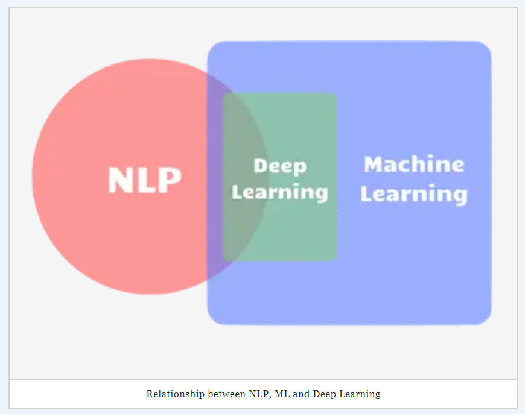

# DEEP LEARNING FOR NATURAL LANGUAGE PROCESSING
Sentiment analysis using deep learning

## About Dataset
**Women's E-Commerce Clothing Reviews on Kaggle**

***Link Dataset***: 

https://www.kaggle.com/nicapotato/womens-ecommerce-clothing-reviews

***Context***

Welcome. This is a Women’s Clothing E-Commerce dataset revolving around the reviews written by customers. Its nine supportive features offer a great environment to parse out the text through its multiple dimensions. Because this is real commercial data, it has been anonymized, and references to the company in the review text and body have been replaced with “retailer”.

***Content***

This dataset includes **23486 rows** and **10 feature variables**. Each row corresponds to a customer review, and includes the variables:
- **Clothing ID**: Integer Categorical variable that refers to the specific piece 
being reviewed.
- **Age**: Positive Integer variable of the reviewers age.
- **Title**: String variable for the title of the review.
- **Review** Text: String variable for the review body.
- **Rating**: Positive Ordinal Integer variable for the product score granted by the customer from 1 Worst, to 5 Best.
- **Recommended** IND: Binary variable stating where the customer recommends the product where 1 is recommended, 0 is not recommended.
- **Positive Feedback Count**: Positive Integer documenting the number of other customers who found this review positive.
- **Division Name**: Categorical name of the product high level division.
- **Department Name**: Categorical name of the product department name.
- **Class Name**: Categorical name of the product class name.

***Acknowledgements***

Anonymous but real source

***Inspiration***

Nicapotato, an owner of dataset Women's E-Commerce Clothing Reviews that looks forward to coming quality NLP! There are also some great opportunities for feature engineering and multivariate analysis.

***Publication***

[Statistical Analysis on E-Commerce Reviews, with Sentiment Classification using Bidirectional Recurrent Neural Network](https://www.researchgate.net/publication/323545316_Statistical_Analysis_on_E-Commerce_Reviews_with_Sentiment_Classification_using_Bidirectional_Recurrent_Neural_Network)

by [Abien Fred Agarap - Github](https://github.com/AFAgarap/ecommerce-reviews-analysis)

## Metadata
**Usage Information**    
- License [CC0: Public Domain](https://creativecommons.org/publicdomain/zero/1.0/)
- Visibility **public**

**Maintainers**
- Dataset owner [nicapotato](https://www.kaggle.com/nicapotato)

**Updates**

    Expected update frequency (Not specified)
    Last updated 2018-02-04
    Date created 2018-02-04      
    Current version Version 1

## Objectives

**Problem Framing**
* How to predict sentiment analysis from Women's E-Commerce Clothing Reviews?

**Ideal Outcome**
* A success metric is that a sentence can be classified as positive, negative, or neutral as predicted by the model. 
* Success means predicting >86% for sentiment analysis. 
* Failure means the number of accuracy sentiment predicted is no better than current heuristics.

**Heuristics**
* Consider reviews of people who buy products in the past. Assume that new items buyers by these people will also become positive, negative, or neutral critics.

**Formulation of the problem**
* The algorithm used for Deep learning is modeling data using RNN Bi-directional Long Short Term Memory (LSTM) Model.

## References
**Natural Language Processing using Deep Learning**

Natural Language Processing (or NLP) is an area that is a confluence of Artificial Intelligence and Linguistics. It involves an intelligent analysis of written language. That terms have a lot of data written in plain text and may automatically get some insights and use NLP techniques. These insights could be - sentiment analysis, information extraction, information retrieval, search, and each name a few.

Deep Learning (which includes Recurrent Neural Networks, Convolution Neural Networks, and others) is a part of the Machine Learning approach. It is an extension of Neural Networks. Deep Learning is used extensively for vision-based classification (for example: distinguishing images of airplanes from pictures of dogs). Deep Learning for NLP tasks as well. However, it is a must to note that Deep Learning algorithms do not exclusively deal with text.

The image below shows the graphical of how NLP is related to Machine learning and Deep Learning. Deep Learning is one of the techniques in terms of Machine Learning - there are several other techniques such as Bi-directional Long Short Term Memory (LSTM) Model.

**Recurrent Neural Network (RNN)**

RNN is a widely used neural network architecture for NLP. It is relatively accurate and efficient for building language models and in the speech recognition process. RNN can learn dependencies than can only learning the latest information. LSTM can help solve this problem because it can understand the current context and dependencies. Therefore, LSTMs are a type of RNN that understanding the context can help.

 

*Recurrent Neural Network (RNN) and Long Short Term Memory(LSTM) Algorithm*

**Bi-directional Long Short Term Memory (LSTM) Network**

As the name suggests, these networks are bidirectional, that is it has access to both past and future input features for a given time. That is important in sequence tagging.

Sources:

- [Machine Learning Crash Course](https://developers.google.com/machine-learning/crash-course)
- [Natural Language Processing vs. Machine Learning vs. Deep Learning](https://sigmoidal.io/natural-language-processing-vs-machine-learning-vs-deep-learning/)
- [Predicting Sentiment from Clothing Reviews](https://www.kaggle.com/burhanykiyakoglu/predicting-sentiment-from-clothing-reviews)
- [Recurrent Neural Networks: Deep Learning for NLP](https://towardsdatascience.com/recurrent-neural-networks-deep-learning-for-nlp-37baa188aef5)

## Programming Methode using Python
**Data Pre-processing**

* Import Dataset
    
    **Noted** 
    
    How to use the Kaggle dataset
    * Login or sign in for the Kaggle websites account.
    * Find the dataset, notebook, and other information that is needed.
    * Make API file .json from the profile account owner.
    * Download API file .json into local computers.

    
* Import Libraries.
* Working with Text.
* Text Cleaning.
* Data Pre-processing for Sentiment Analysis.

**Data Preparation for the model**
* Import Libraries.
* Import GloVe.

    GloVe - Global vector to represent and classify words contained in statements.
    
    Source URL:https://www.kaggle.com/watts2/glove6b50dtxt
    
* Word Preprocessing creating a subset of the data frame.
* Converting the panda series to NumPy array.
* Tokenizing the strings.
* Finding the maximum length of a review.
* Create the word to index and index to word vectors.
* Loading the GloVe embeddings.
* Preparing the embedding matrix.
* Convert the tokenized sequencer to the 2D matrix for each text entry. 
* Preprocessing the text to create indices.

**Modeling the text data**
* Dividing into training and test data set.
* Building the Bidirectional LSTM model.
* Compiling and fitting models.

**Evaluate the model**

## Results

    The number of trainable params is 754,253* for the sequential model.
    
 
    
    - Evaluating the model on the test data set.
    - Based on the accuracy, success metric predicting >86% for sentiment analysis using the model.
    - RNN Bi-directional Long Short Term Memory (LSTM) Model can pursue analysis sentiment such as positive, neutral, negative comments.

